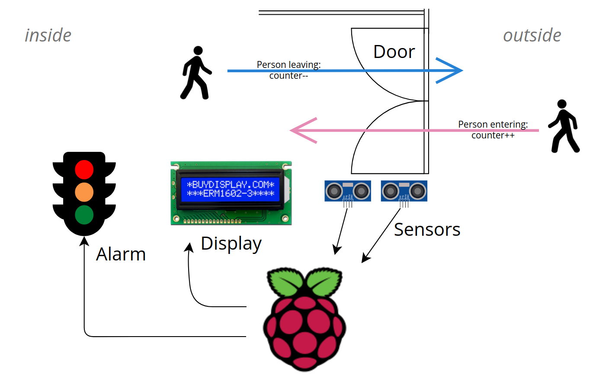

# People counter

We are planning to develop a machine that can count the number of people in a closed room. This can be useful to comply with any regulations on the number of participants at events in the context of infection control laws.

## Objectives:

- Accurate detection (one by one) of people passing through a door.

- Differentiation between two directions of movement: going in and going out
- Keeping a constantly updated count of people in a room
- Showing the counter status on a display
- Possibility to set a limit of participants with ongoing comparison between the limit and the current status
- Displaying a warning (either on the display or with a light signal), in case of:
  - approaching the limit
  - reaching the limit
  - exceeding the limit

## Approach:

Our goals are achieved by placing sensors at the entrance to the room. These sensors can register whether a person enters or leaves the room. This data is collected, stored and processed by a Raspberry Pi. The Pi also controls the output on the display and on the optionally existing light signal system.

