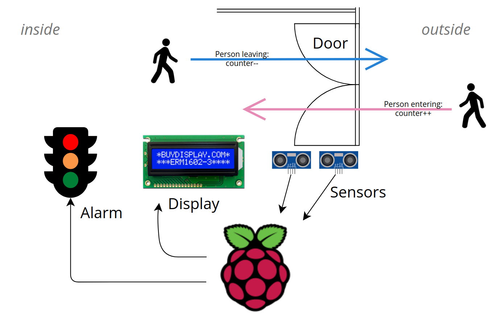
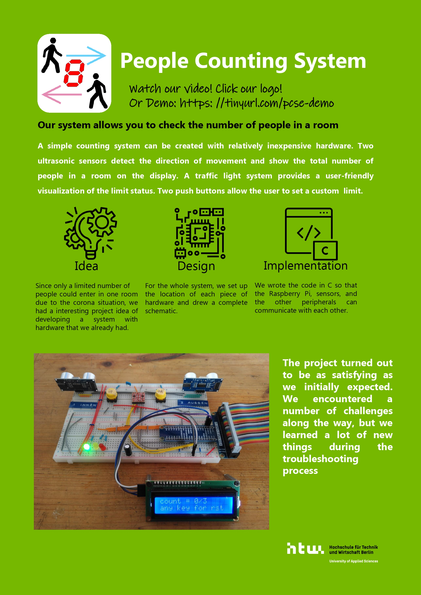

# People Counting System (PCS)

> This project was developed as part of the course "Project Computer Systems Engineering" in the [Computer Engineering](https://ce-bachelor.htw-berlin.de/) program at [HTW Berlin](https://www.htw-berlin.de/).

## Abstract:

We are planning to develop a machine that counts the number of people in a room. This can be useful to comply with any regulations on the number of participants at, e.g. in the context of infection control laws.

## Approach:

Our objectives are achieved by placing sensors at the entrance of the room. These sensors can register whether a person enters or leaves the room. The data is collected, stored and processed by a *Raspberry Pi*. The *Pi* also controls the output of the display and the optional light signalling system.



## Installation

Assuming you have cloned this Repo to your Pi and your in the project directory.

```
cd src
make
sudo make install
```

## Demo

<iframe src="https://mediathek.htw-berlin.de/media/embed?key=32b1e746ed77554b97dea0341d423c2c&width=720&height=405&autoplay=false&controls=true&autolightsoff=false&loop=false&chapters=false&playlist=false&related=false&responsive=false&t=0&loadonclick=true&thumb=true" data-src="https://mediathek.htw-berlin.de/media/embed?key=32b1e746ed77554b97dea0341d423c2c&width=720&height=405&autoplay=false&controls=true&autolightsoff=false&loop=false&chapters=false&playlist=false&related=false&responsive=false&t=0&loadonclick=true" class="" width="720" height="405" title="People Counting System (Demo) - Projekt Computer Systems Engineering" frameborder="0" allowfullscreen="allowfullscreen" allowtransparency="true" scrolling="no" aria-label="media embed code" style=""></iframe>

[Video in the HTW Mediathek](https://mediathek.htw-berlin.de/video/People-Counting-System-28Demo29-2D-Projekt-Computer-Systems-Engineering/32b1e746ed77554b97dea0341d423c2c)

## [Poster](doc/poster/pcsposter5.pdf)

