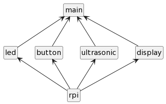

## Module structure
Every module is implemented with its own header file `.h` and implementation file `.c`, except _main_ has only an implementation file. The build process is automated with **make**.  

[Read more](https://github.com/techn0punk/people-counting-system/wiki/Implementation)